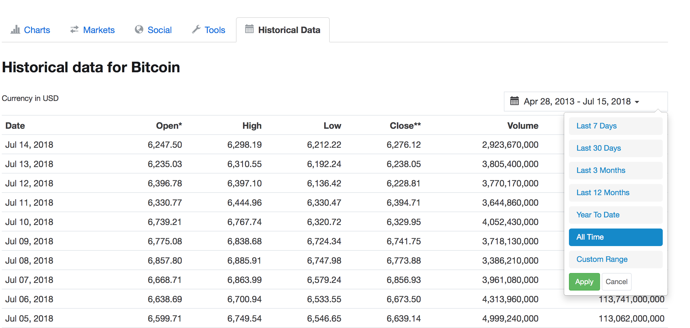

## 1. 크롤링 연습
- 비트코인 데이터를 크롤링하여 원하는 형식에 맞게 csv파일로 저장해봅시다.
- 링크: [https://coinmarketcap.com/currencies/bitcoin/historical-data/?start=20130428&end=20180715](https://coinmarketcap.com/currencies/bitcoin/historical-data/?start=20130428&end=20180715)
- 밑에 스크롤 내리시다보면 historical data 있습니다. All time의 데이터를 얻으셔도 좋고 적당히 많은 날에 대한 데이터를 얻으셔도 됩니다.

## 2. Numpy 연습
- 1에서 얻은 데이터를 활용하여 Numpy 사용을 연습해봅시다.
- 1에서 얻은 데이터의 open열과 close열을 각각 numpy array로 저장해봅시다.
    - 힌트: data frame의 열벡터를 numpy array로 형변환할 수 있습니다.
- open열의 데이터와 close열의 데이터의 Pearson's correlation coefficient을 구해봅시다.
- Pearson's correlation coefficient
    - [정의](https://en.wikipedia.org/wiki/Pearson_correlation_coefficient#For_a_population)
    - 구글에서 다른 정의를 찾아 구현하셔도 돼요!